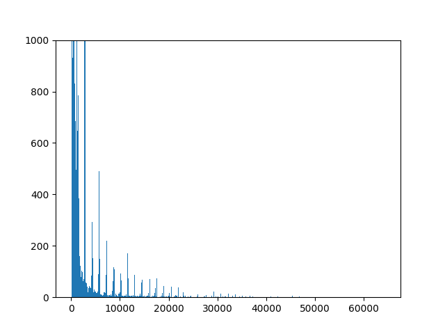

# Assignment 2
Capture flow data with pmacct to a CSV file. Write a python script to load 
the CSV file into a PANDAS dataframe, print the minimum and maximum 
number of flow bytes, and plot the histogram of flow bytes; 
**all with PANDAS functions (use v1.4 of PANDAS).** Showing detail in the histogram
 so do not use the default number of bins, use many more.
 Hint: use column=’BYTES’ as one of the arguments to the hist() function to 
get it to work correctly. Submit this python script through Blackboard. 

## Script 
``` python 
import pandas as pd
import numpy as np
import matplotlib.pyplot as plt

MyData = pd.read_csv('NetFlow_v2.csv')

print(MyData['BYTES'].min(),MyData['BYTES'].max(), MyData['BYTES'].mean())

min_val = MyData['BYTES'].min()
max_val = MyData['BYTES'].max()
avg_val = MyData['BYTES'].mean()

plt.ylim(0,1000)
plt.hist(MyData['BYTES'],bins = 500, range=[min_val,max_val])
plt.savefig('NetFlow2')
```

## Images
* NetFlow

        
